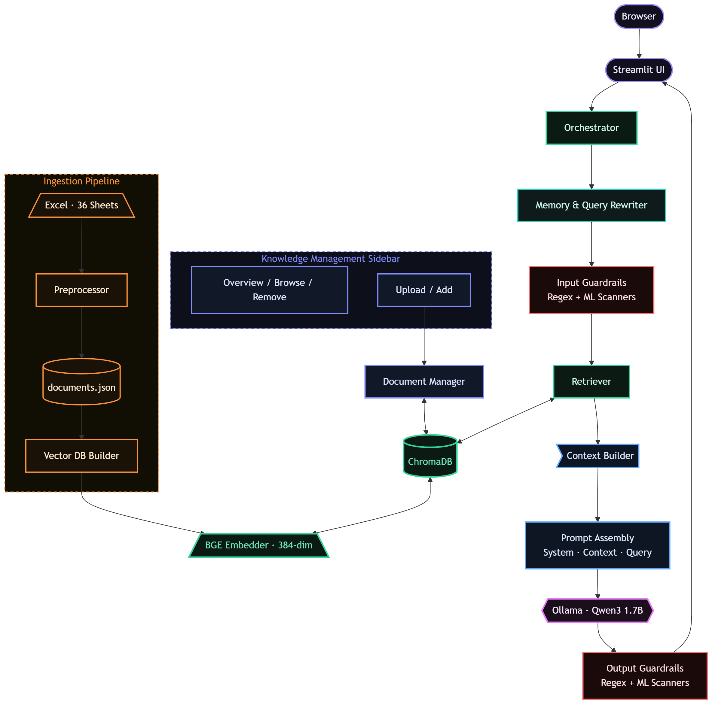
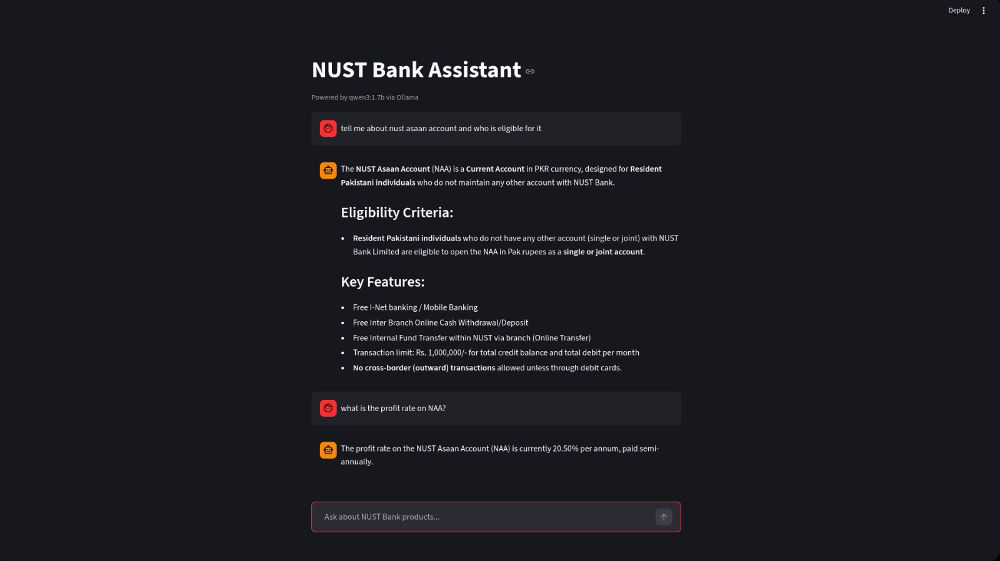

# Bank Assistant

A RAG project for answering questions about NUST Bank products.
It reads the bank's Excel knowledge base, turns it into clean documents, builds a local vector database, and answers questions through a Streamlit chat interface powered by a local LLM via Ollama.
All user input and LLM output passes through a multi-layer security pipeline before anything reaches the model.
The system supports real-time knowledge updates — new FAQ documents can be uploaded and become instantly searchable, and outdated information is automatically replaced.

## System Architecture

The diagram below shows how data flows through the system — from the raw Excel knowledge base, through preprocessing and vector embedding, to the final RAG-powered chat interface.



## What it uses

- Python 3.12
- `uv` for environment and package management
- `openpyxl` for reading the Excel file
- `sentence-transformers` (`BAAI/bge-small-en-v1.5`) for embeddings
- `ChromaDB` for the local vector store
- `Ollama` + `qwen3:1.7b` as the local LLM
- `llm-guard` for ML-based input and output scanning
- `Streamlit` for the chat UI
- `pytest` for tests

## Project flow

```
scripts/preprocess.py        reads Excel -> data/processed/documents.json
scripts/build_vectordb.py    chunks + embeds -> data/vectorstore/
scripts/document_manager.py  real-time CRUD for vector DB (add/update/delete)
scripts/guardrails.py        multi-layer security pipeline (regex + ML scanners)
scripts/rag_pipeline.py      retrieves context + calls Ollama
app.py                       Streamlit chat UI with knowledge management sidebar
```

## Security pipeline

Every query passes through three layers before reaching the LLM, and every response passes through two layers before being returned.

**Input layers:**
1. Sanity checks (type, empty, length limit)
2. Regex patterns for jailbreak attempts, off-topic requests, and prompt injection
3. ML scanners via llm-guard: PromptInjection, Toxicity, BanTopics, Gibberish, TokenLimit, InvisibleText

**Output layers:**
1. Regex patterns for sensitive data leakage (system prompt markers, card numbers, credentials)
2. ML scanner via llm-guard: BanTopics (blocks violence, politics, drugs, hacking)

Blocked inputs and outputs return a fixed safe response without ever reaching the LLM.

## Setup

### 1. Install uv and Python

```bash
uv python install 3.12
uv sync --dev --all-extras --python 3.12
```

No NVIDIA or CUDA required — this project runs entirely on CPU.

### 2. Install Ollama

**Linux (requires sudo):**
```bash
curl -fsSL https://ollama.com/install.sh | sh
```

Then pull the model:
```bash
ollama pull qwen3:1.7b
```

## Run the project

### 1. Preprocess the bank data

```bash
uv run python scripts/preprocess.py
```

### 2. Build the vector database

```bash
uv run python scripts/build_vectordb.py
```

The embedding model (`BAAI/bge-small-en-v1.5`) is downloaded from HuggingFace on the first run and saved to `data/models/` — subsequent runs load from disk.

### 3. Start Ollama

```bash
ollama serve
```

Keep this running in a separate terminal.

### 4. Launch the chat app

```bash
uv run streamlit run app.py
```

Open `http://localhost:8501` in your browser and ask questions about NUST Bank products.

## Real-Time Knowledge Management

The app sidebar (`Knowledge Base`) provides a robust, state-persistent tab structure for managing the database dynamically:

- **Overview** — High-level dashboard displaying total chunks, active sources, and disk storage metrics.
- **Upload** — Drops in JSON files for processing. It intelligently auto-detects standard document arrays (`docs::`) vs categorized FAQ structures (`faq::`), mapping them appropriately. It leverages `upsert` functionality to deliberately overwrite overlapping collision IDs to prevent duplicate vectors or silent failure drops. 
- **Add** — Quickly inject single manual Q&A pairs directly into the store.
- **Browse** — Interactive expanding categorical library of ingested sources. It features a scalable `Load More` paginated viewer handling thousands of vector embeddings without freezing the backend, and includes 1-click single-chunk trash deletion.
- **Remove** — Permanently purges entire origin sources from the database and updates the active context.

All changes take effect immediately — no rebuild, app crash, or system restart needed.

### How updates work

Each uploaded file is tagged as a **source** (derived from the filename). When the same file is re-uploaded:

1. All existing chunks from that source are deleted
2. The new file is parsed, chunked, and embedded
3. New chunks are added to the vector store

This guarantees no stale data remains within a source. Every managed chunk also carries an `ingested_at` timestamp for conflict resolution across sources.

## Usage Example

Below is an example of the chatbot in action, answering a user question about NUST Bank products:



## Run tests

All unit tests (no Ollama needed):
```bash
uv run pytest tests/ -v
```

Document manager tests only:
```bash
uv run pytest tests/test_document_manager.py -v
```

Full test suite including real ML models and live Ollama (requires Ollama running):
```bash
uv run pytest tests/ -v --run-e2e
```

## Notes

- Source data: [NUST Bank-Product-Knowledge.xlsx](NUST%20Bank-Product-Knowledge.xlsx)
- FAQ data: [funds_transfer_app_features_faq (1).json](<funds_transfer_app_features_faq (1).json>)
- Processed documents: [data/processed/](data/processed)
- Vector store: [data/vectorstore/](data/vectorstore)
- Cached embedding model: `data/models/` (excluded from git)
- Terminal logs show the query, retrieved chunks, and context on every request
- llm-guard ML models are downloaded on first run and cached by HuggingFace